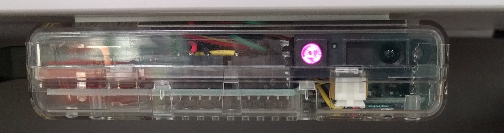
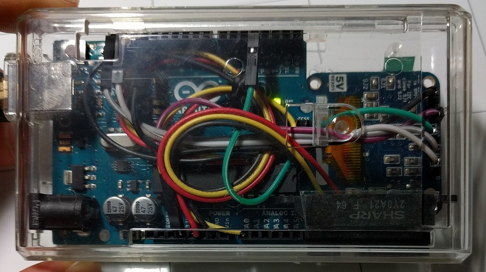
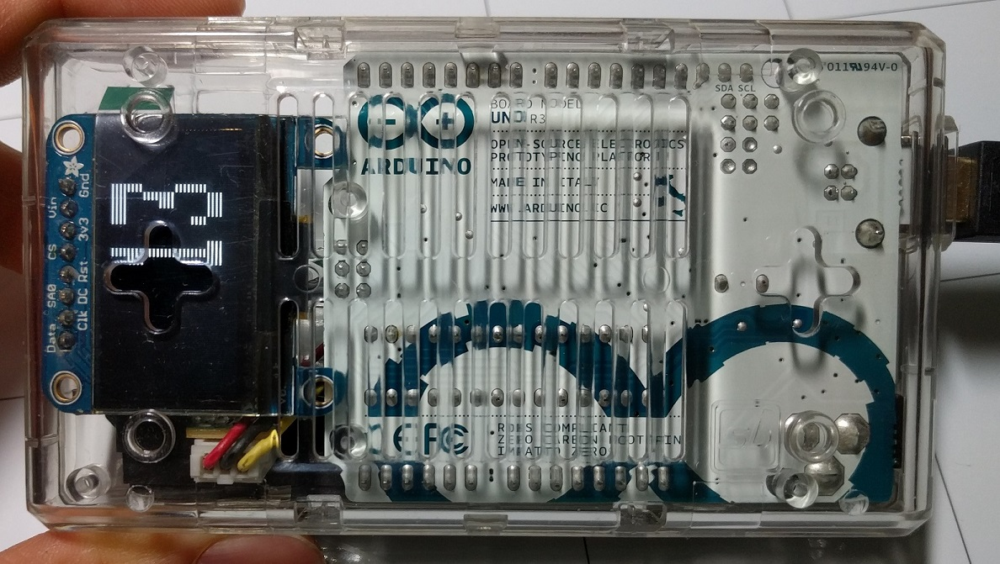
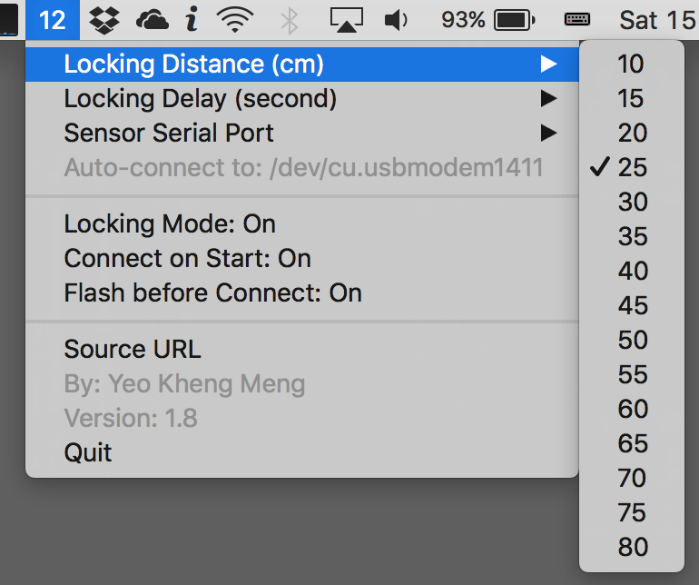
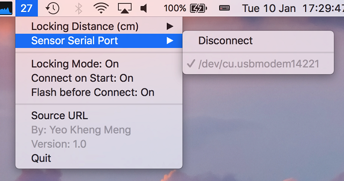

# Distance Machine Locker

A system that locks your computer the moment you move away from it. An Arduino-based hardware senses how far are you away from the computer and reports it to a host app on your machine. When a set threshold has been reached, the machine is locked.

Only Mac OS is supported at this time.

## Demo media

Video of everything in action.

My device deployed under my desk. The purple light coming from the sharp IR sensor cannot be seen with a naked eye but the camera can.

Front view of device

Back view of device. The OLED screen shows the current distance.

  
Feature to customise the locking distance threshold.

  
Shows the currently connected USB Serial port as well as other ports if available.

## Features

1. Locks Mac on threshold reached
2. Shows live distance reading on menubar
3. Customisable threshold from 10cm to 80cm which is the effective range of the IR sensor
4. Choice to flash firmware before connection
5. Choice to auto connect to device if only one sensor is found
6. Locks machine if device is disconnected
7. Notifications to indicate flashing/connect/disconnect status
8. If locking mode is disabled for testing purposes, a red background is placed behind the distance text to alert the user of lack of security.

## Rough steps to quick start

1. Build the hardware, connect it to your Mac
2. Download and install the Arduino app into `/Applications`
2. Use Arduino app to flash firmware or flash from command line. Replace path to `distance-machine-locker-arduino.hex` and serial port `/dev/ttyusbmodemX` with the exact ones. `/Applications/Arduino.app/Contents/Java/hardware/tools/avr/bin/avrdude -C /Applications/Arduino.app/Contents/Java/hardware/tools/avr/etc/avrdude.conf -p atmega328p -b 115200 -c arduino -U flash:w:distance-machine-locker-arduino.hex:i -P /dev/ttyusbmodemX`
3. Download from releases, Unzip and copy `Distance Mac Locker.app` into `/Applications`
4. Start the app
5. Connect to the associated USB Serial port
6. Turn off locking mode and decide your threshold distance
7. Set your threshold distance and turn locking mode back on
8. Optionally turn on `Connect on Start` and `Flash before Connect`
9. Make app start on login by. System Preferences -> Users and Groups -> Login Items -> + app into list

## Documentation

Extra documentation is available in the readme files of the subdirectories.

1. [Hardware schematic and components](schematic/README.md)
2. [Arduino Code](distance-machine-locker-arduino/README.md)
3. [Swift Host Code](Distance Mac Locker/README.md)
