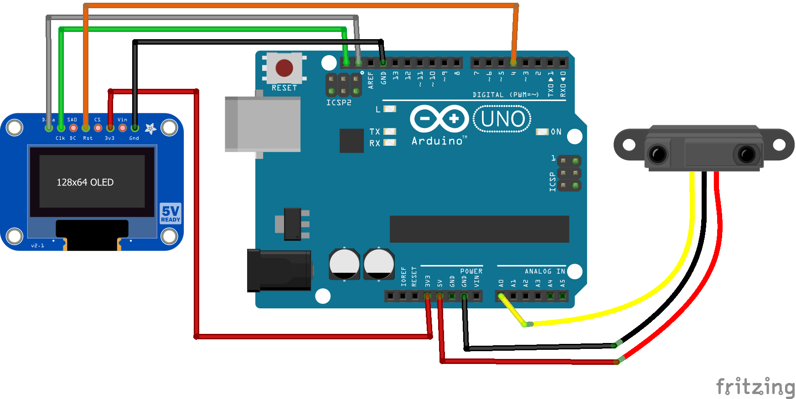

# Distance Machine Locker hardware

## Schematic

## Components

1. Arduino Uno R3
2. [Sharp GP2Y0A21YK IR sensor 10-80cm](http://www.sgbotic.com/index.php?dispatch=products.view&product_id=20)
3. [Arduino Mega 2560 R3 clear enclosure](http://www.sgbotic.com/index.php?dispatch=products.view&product_id=1602)
4. Standard Type-A to Type-B USB cable
5. [Adafruit Monochrome 1.3" 128x64 OLED](https://www.adafruit.com/product/938)

## Component comments

The use of a case meant for the larger Arduino is so we have extra space to accomodate the components.

OLED is optional in the operation of the device. It is just for my debugging of the sensor. I have tested the code to still work even without the OLED.
